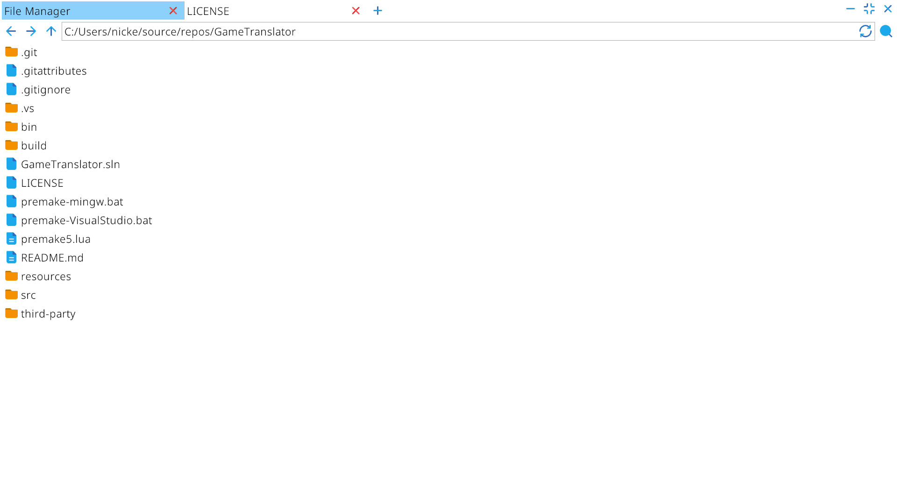
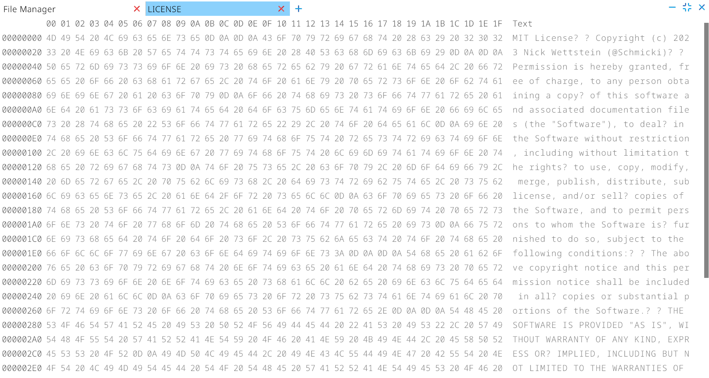
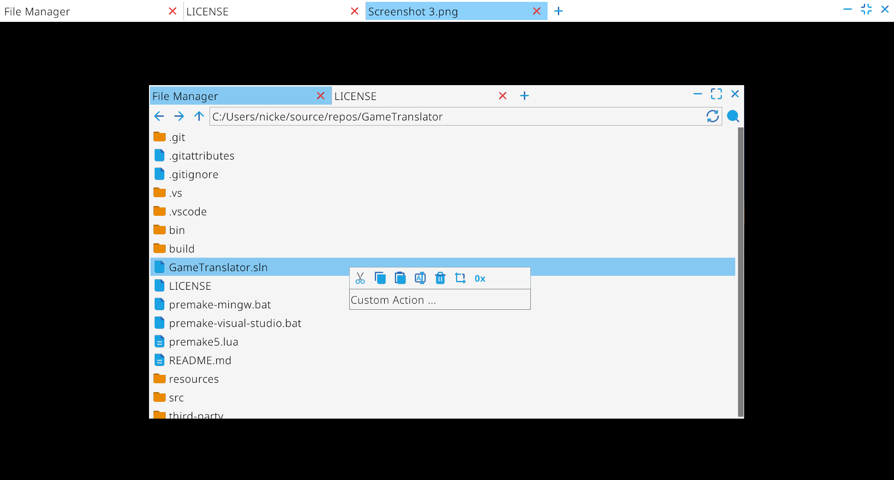

# Game Translator

 An allround tool to translate video games.

## Features

- File Manager
  
  - Filters (TODO)
  
  - File Trimming
  
  - Custom File Actions

- Hex Viewer

- Image Viewer

- Table Editor (TODO)

- Text Editor (TODO)

## Supported Formats

| Format | Description                                                                                   |
| ------ | --------------------------------------------------------------------------------------------- |
| .gxt   | Image format used on PS Vita                                                                  |
| .gz    | GZip Archive                                                                                  |
| .dat   | Archive format used in: Saenai Heroine no Sodatekata: 〜blessing flowers〜 & Toradora Portable! |
| .png   | Image format                                                                                  |
| .jpg   | Image format                                                                                  |
| .bmp   | Image format                                                                                  |
| .gif   | Image format                                                                                  |

## Supported Games

| Game                                                   | Formats         |
| ------------------------------------------------------ | --------------- |
| Saenai Heroine no Sodatekata: 〜blessing flowers〜 (WIP) | .dat, .gz, .gxt |

## Screenshots

## License

[MIT License](https://github.com/Schmicki/GameTranslator/blob/main/LICENSE)
