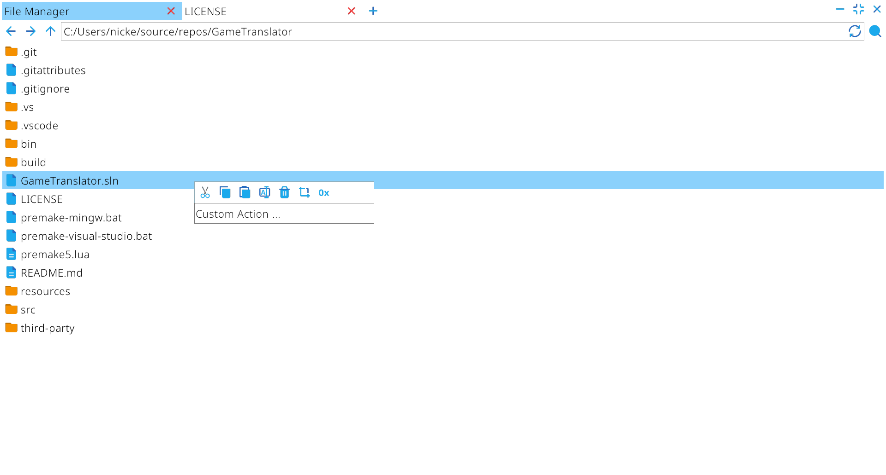

# GameTranslator

 An allround tool to translate video games.

## Features

- File Manager
  
  - Filters (TODO)
  
  - File Trimming
  
  - Custom File Actions

- Hex Viewer

- Image Viewer

- Table Editor (TODO)

- Text Editor (TODO)

## License

[MIT License](https://github.com/Schmicki/GameTranslator/blob/main/LICENSE)
